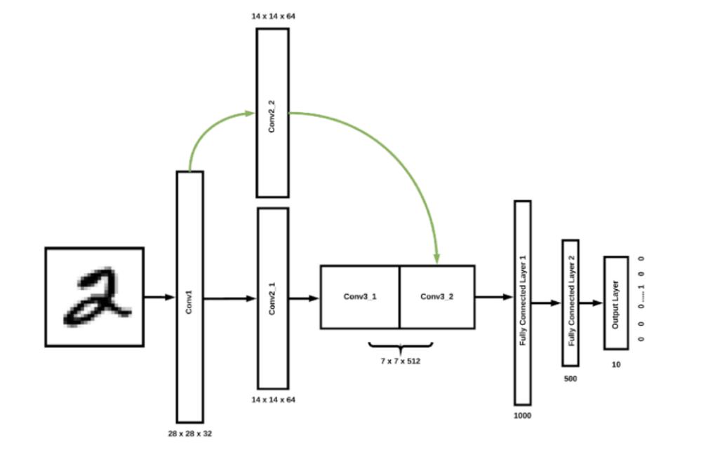
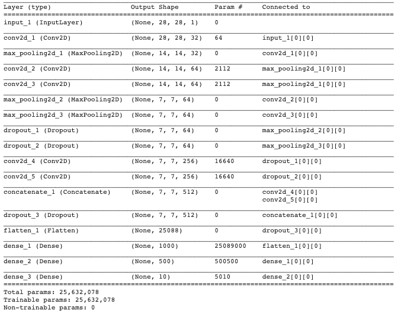

#  Digit Classifier App


## Instructions
1. Develop a NN training pipeline for MNIST handwritten digit classification. 
2. Implement an inference server with the trained model. The server should accept raw images as input and preduct the number with a probability. 


## Requirements

This application is written using Python 3.6.

Main Modules:
- Tensorflow (1.12.0)
- Keras
- Numpy (1.16.0)
- Flask (1.0.2)
- Gunicorn (19.9.0)

## Instructions

This repository contains the source code for a Python Flask Server application that has a Keras ML model deployed. REST API is used to communicate with the deployed model. The application allows one to upload an image of a handwritten digit and it returns the predicted digit. 


Clone the repo, install the dependencies, and download the model weights. 

```bash
git clone https://github.com/ilopezfr/digit-classifier-app.git
cd digit-classifier-app
```

Create virtual environment and activate it:
```bash
virtualenv -p /usr/local/bin/python3.6 venv
source venv/bin/activate
```
Install dependencies:
```bash
pip install -r requirements.txt
```
<!--
Download the model.h5 and save it into model folder
```bash
wget "https://drive.google.com/open?id=15ij4G9nYEb74CqhqooXRIyWjfJrqDmey" -P /model
```
-->


## Overview of the Code
This repo is structured as follows:

```bash
├── model
|    ├── predict.py
|    ├── train.py
|    ├── model-weights.h5
|    ├── model.json
|    ├── model-weights-lite.h5
|    ├── model.json
├── templates
|    ├── error.html
|    ├── index.html
|    ├── predict.html
├── tests
|    ├── conftest.py
|    ├── test_app.py
├── app.py
├── Procfile
```

## Train the model
A trained model file on MNIST dataset is already offered and can be directly downloaded from [this link](https://drive.google.com/open?id=15ij4G9nYEb74CqhqooXRIyWjfJrqDmey). However, should you want to rebuild the model using the same architecture, you can run the following script:

```bash
python model/train.py
```
This will create a model file `model.h5` in the folder `\model`. Now we are ready to serve the model via Flask. 

## Quick model inference in local
To quickly test the model in one file, simply run the following line of code:
```bash
python model/predict.py -f <path/to/file>
```
It currently accepts images with the extensions 'png', 'jpg' and 'jpeg'.


## Start the server application and predict on a new image.
Flask allows you to serve an image of a handwritten digit with the server and get a prediction. 

In the code below, I provide a REST endpoint that supports GET and POST requests.

```bash
$ python app.py
* Serving Flask app "app" (lazy loading)
...
* Running on http://127.0.0.1:5002/
```
You can now access the REST API via http://127.0.0.1:5002.

While lightweight, Flask's built-in server is not suitable for production as it doesn't scale well. For production purposes, I've deployed the app in Heroku. 

This can be access at:
https://quiet-journey-42975.herokuapp.com/

## Model Architecture



The neural network contains 3 Convolutional layers, followed by 2 Fully Connected layers and 1 output layer that provides the estimations for each one of the 10 digit categories. 


